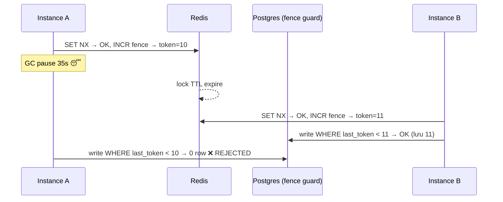

# Lesson 19c — Distributed Lock (Redis SET NX, Redlock, Fencing Token)

> **Status**: ✅ Done · Day 19
> **Related code**: [`RedisDistributedLock.java`](../../common-lib/src/main/java/com/ecom/common/lock/RedisDistributedLock.java) · [`InventorySnapshotJob.java`](../../services/inventory-service/src/main/java/com/ecom/inventory/application/InventorySnapshotJob.java)

---

## 🎯 TL;DR

> Distributed lock cần cho cross-process critical section (vd: scheduled job
> leader election). Redis `SET NX PX` đủ cho 95% case (best-effort mutual
> exclusion). NHƯNG lock alone **KHÔNG** chống được GC-pause split-brain →
> mission-critical phải dùng **fencing token** enforce ở resource, không tin lock.

---

## 📚 Cơ bản: Redis SET NX PX

```
SET resource_name unique_value NX PX 30000
# NX = set if not exists
# PX 30000 = expire 30s (chống deadlock khi process chết)
# unique_value = UUID, để release đúng owner (không xóa lock của process khác)
```

Release phải dùng Lua script (atomic check-and-delete):

```lua
if redis.call("get", KEYS[1]) == ARGV[1] then
  return redis.call("del", KEYS[1])
else
  return 0
end
```

Code thật: [`RedisDistributedLock`](../../common-lib/src/main/java/com/ecom/common/lock/RedisDistributedLock.java)
— `setIfAbsent(key, token, ttl)` để acquire, `DefaultRedisScript` Lua để release.

---

## ⚠️ The Big Trap — GC pause / network delay

> **Scenario** (Martin Kleppmann's argument):
> 1. Process A acquire lock, TTL 30s.
> 2. Process A vào GC pause 35s.
> 3. Lock expire ở Redis. Process B acquire same lock — Redis cho OK.
> 4. Process A wake up khỏi GC, NGHĨ rằng vẫn giữ lock → write to DB.
> 5. Cả A và B cùng write → corrupt data.

→ **Lock alone không đủ** cho mission-critical work.

## 🆚 Approaches compared

| Approach | Safety guarantee | Cost | Khi nào dùng |
| --- | --- | --- | --- |
| Single Redis SET NX | "Best effort" — KHÔNG safe vs GC pause | Trivial | Job scheduler, refresh task — chấp nhận overlap |
| Redlock (≥3 Redis node) | Tốt hơn nhưng vẫn có debate | Phức tạp, latency cao hơn | (controversial) — nhiều người không recommend |
| ZooKeeper / etcd ephemeral node | Strong consistency (consensus) | Cost ops cao, latency 10-50ms | Critical leader election |
| **Fencing token** | Provable correct — kết hợp với resource | Cần resource support compare-and-set | **Recommended cho money/inventory work** |

## 🛡️ Fencing token — cách giải đúng

- Mỗi lần acquire lock, `INCR` 1 counter bền → trả về token tăng đơn điệu (1, 2, 3, ...).
- Khi process write to resource, gửi kèm token. **Resource** (DB) reject nếu token
  nhỏ hơn token đã thấy lần trước. Lock không cần "đúng" — resource mới là trọng tài.
- GC pause scenario: A có token=10, B sau acquire có token=11 và write trước. A
  wake up gửi token=10 → DB từ chối vì đã thấy 11. **Split-brain bị chặn tại DB.**

Code thật: [`LockHandle.fencingToken`](../../common-lib/src/main/java/com/ecom/common/lock/LockHandle.java)
+ enforce ở [`InventorySnapshotRepository.upsertWithFence`](../../services/inventory-service/src/main/java/com/ecom/inventory/domain/InventorySnapshotRepository.java)
(`ON CONFLICT ... WHERE last_fencing_token < EXCLUDED.last_fencing_token`).



## 🎯 Chosen cho project

- **Default**: Redis SET NX PX cho leader-elect daily snapshot job (nhiều instance).
- **Correctness**: thêm fencing token enforce ở DB upsert — chống stale writer.
- **Payment idempotent**: KHÔNG dùng distributed lock — dùng DB unique constraint
  + idempotency key ([Day 10](10-idempotency.md)). Lock không cần thiết ở đó.
- **NOT Redlock**: project chỉ 1 Redis node; Redlock thêm phức tạp mà vẫn không
  cứu GC pause → fencing token là câu trả lời đúng, không phải thêm node.

## ⚠️ Cạm bẫy

- Quên Lua script khi release → race khi TTL expire xen giữa GET và DEL.
- TTL quá ngắn → process bình thường cũng mất lock giữa chừng.
- TTL quá dài → process chết = block lâu (tới khi expire).
- Fencing counter đặt TTL → token reset → mất tính đơn điệu. Phải để bền (no expire).
- Tin "acquire lock OK = an toàn write" → đúng bug gây sự cố ([issue 19](../issues/19-redlock-correctness.md)).

## 🎤 Trả lời phỏng vấn

> **"Redis distributed lock có safe không?"** Best-effort. An toàn cho mutual
> exclusion thông thường (giảm trùng), KHÔNG an toàn vs GC pause/STW dài — đó là
> lý do mission-critical cần fencing token.

> **"Redlock là gì, sao có debate?"** Redlock = lock qua ≥3 Redis node độc lập,
> majority quorum. Kleppmann phản biện: vẫn không an toàn vs pause vì giả định
> đồng hồ/timing. antirez phản biện lại. Kết luận thực dụng: cần correctness thì
> dùng fencing token + resource, đừng phụ thuộc lock alone.

> **"Khi nào distributed lock vs DB unique constraint?"** Unique constraint khi
> có thể biểu diễn invariant bằng key (idempotency, dedup) — đơn giản + đúng.
> Distributed lock khi cần serialize một đoạn xử lý không map được vào 1 key (vd
> leader-elect job) — và vẫn nên kèm fencing nếu write quan trọng.

## 🔗 Related

- [`issues/19-redlock-correctness.md`](../issues/19-redlock-correctness.md)
- [`lessons/10-idempotency.md`](10-idempotency.md) · [`lessons/19-java-locking.md`](19-java-locking.md)
- Refs: Martin Kleppmann "How to do distributed locking", antirez response.
