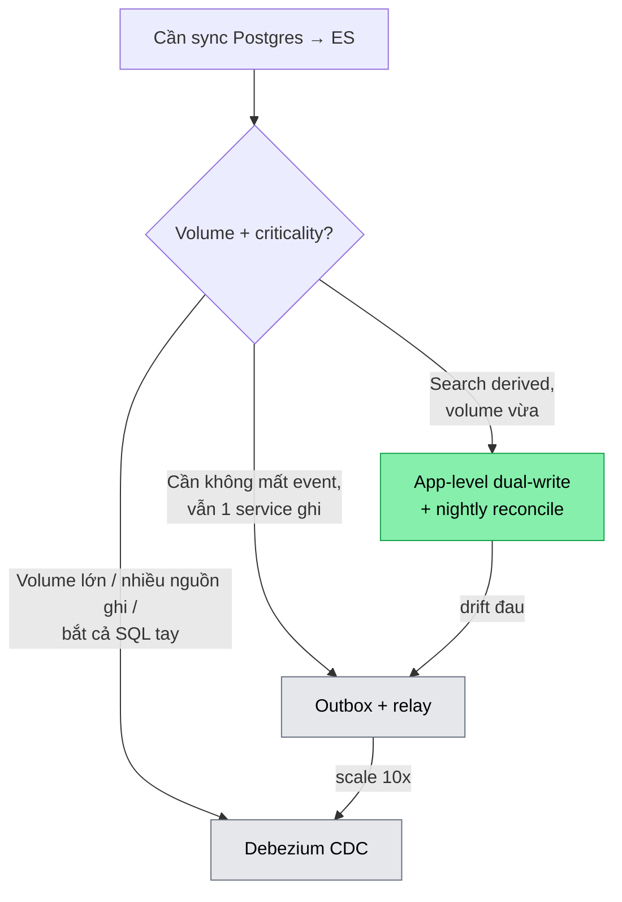

# 🔄 Lesson 22b — Sync Postgres → ES: app-level vs outbox vs Debezium CDC

> **Day 22** · Tag: `search` `cdc` `sync` `dual-write`
> Liên quan: [22 — ES basics](22-elasticsearch-basics.md) ·
> [13 — outbox pattern](13-outbox-pattern.md) ·
> [13b — dual-write problem](13b-dual-write-problem.md) ·
> [ADR-009 outbox-vs-cdc](../decisions/009-outbox-vs-cdc.md) ·
> [issue 22 — sync drift](../issues/22-es-postgres-sync-drift.md)

---

## TL;DR

Postgres là source of truth, ES là search index — **derived data**. Mỗi lần catalog
đổi (create/update/archive), phải đẩy thay đổi sang ES. Có 3 cách chính, đánh đổi
**đơn giản ↔ độ chính xác sync**:

| Approach | Cách hoạt động | Pros | Cons |
|---|---|---|---|
| **App-level dual-write** | App ghi DB rồi publish Kafka event (sau commit) | Đơn giản nhất, không thêm hạ tầng | **Dual-write problem**: commit OK + publish fail → drift |
| **Outbox + relay** (Day 13) | Ghi event vào bảng `outbox` CÙNG transaction DB; relay poll → publish | Atomic với DB (1 transaction), không mất event | Thêm bảng + relay scheduler; latency poll interval |
| **Debezium CDC** | Đọc **WAL** (write-ahead log) Postgres → stream change ra Kafka | App KHÔNG biết gì về sync; bắt mọi thay đổi (kể cả SQL tay) | Vận hành Debezium + Kafka Connect; ops nặng |

**Day 22 chọn app-level dual-write** — có chủ ý. Search index non-critical → drift
sửa được bằng nightly reconcile. Outbox/Debezium để dành khi drift đo được vượt ngưỡng
(Day 25 đánh giá).

---

## 🩹 Dual-write problem — nhắc lại từ Day 13

Day 13 order-service đã gặp vấn đề này: ghi 2 nơi (DB + Kafka) không thể atomic mà
không có distributed transaction.

```
@Transactional
create(product) {
   productRepository.save(product);   // (1) commit Postgres ✅
}                                       //     ... commit xong
publisher.publishUpserted(event);      // (2) publish Kafka ❌ Kafka down
```

Nếu (1) commit OK nhưng (2) fail → Postgres có product mới, ES không bao giờ nhận →
**drift**: search không ra product vừa tạo (hoặc ra giá cũ / product đã xóa).

> 💡 **Vì sao publish SAU commit, không phải trong?** Nếu publish trong transaction
> rồi transaction rollback (CHECK constraint fail lúc flush), ta đã bắn event
> **phantom** cho 1 product không tồn tại. Project dùng
> `TransactionSynchronization.afterCommit()` — chỉ publish khi DB đã chắc chắn
> commit. Đây là nửa "best-effort" của dual-write: loại được phantom, nhưng KHÔNG
> loại được mất-event-sau-commit.

---

## 🆚 3 approach chi tiết

### 1. App-level dual-write (Day 22 chosen)

```java
// ProductService — afterCommit publish
runAfterCommit(() -> publisher.publishUpserted(event));
```

- Đơn giản: chỉ cần KafkaTemplate + 1 consumer index vào ES.
- Drift xảy ra khi: Kafka down lúc publish, hoặc app crash giữa commit và afterCommit
  callback (callback chạy in-memory, không bền).
- **Sửa drift**: nightly **reconcile** job — so sánh count Postgres ACTIVE vs ES docs
  (`GET /admin/search/drift`), nếu lệch → `POST /admin/search/reindex`. Vì search là
  derived + non-critical, "đúng sau vài giờ" chấp nhận được.

### 2. Outbox + relay (đã có ở order-service Day 13)

- Event ghi vào bảng `outbox_event` **cùng transaction** với product → atomic. Không
  bao giờ mất event.
- Relay `@Scheduled` poll PENDING → publish → mark SENT (SKIP LOCKED chống 2 instance
  double-publish).
- Chi phí: thêm 1 bảng + scheduler vào product-service (vốn là catalog đơn giản).
  Day 22 đánh giá là **over-engineer cho volume hiện tại** — nhưng đây là đường nâng
  cấp đầu tiên khi drift đau.

### 3. Debezium CDC (Change Data Capture)

- Debezium đọc **WAL** Postgres (logical replication slot) → mọi `INSERT/UPDATE/DELETE`
  (kể cả admin chạy SQL tay) thành event Kafka → consumer index ES.
- App **không biết gì** về ES — decoupling tối đa. Bắt được cả thay đổi ngoài app.
- Chi phí ops nặng: chạy Kafka Connect + Debezium connector, quản lý replication slot
  (slot không consume → WAL phình → disk đầy), schema change handling.
- Đáng dùng khi: volume lớn (10M+), nhiều service ghi cùng bảng, hoặc cần bắt thay
  đổi ngoài đường app.

---

## 🧭 Decision tree



---

## ✅ Khi nào dùng cái nào

- **App-level**: prototype, search derived non-critical, 1 service own data, volume
  vừa, có nightly reconcile. ← Day 22.
- **Outbox**: cần đảm bảo không mất event (như order Day 13), vẫn muốn app control,
  chưa đến mức cần CDC.
- **Debezium**: volume lớn, nhiều nguồn ghi, cần bắt thay đổi ngoài app, có team lo ops.

## ❌ Cạm bẫy

1. **Tưởng app-level là "đủ tốt mãi mãi"** — drift tích lũy âm thầm. Phải có metric
   drift + reconcile, không thì 6 tháng sau search đầy rác.
2. **Ordering**: nếu `upserted` và `deleted` đi 2 partition khác nhau (key khác) →
   `deleted` có thể tới trước `upserted` → product "sống lại" trong index. Project
   key = `productId` cho cả 2 topic → cùng partition → đúng thứ tự.
3. **Outbox quên SKIP LOCKED** → 2 relay instance publish trùng.
4. **Debezium replication slot bỏ quên** → WAL không được consume → Postgres disk đầy
   → DB chết. Lỗi ops kinh điển.

---

## 🎤 Trả lời phỏng vấn

**"Sync Postgres sang ES thế nào? Dual-write problem giải sao?"**
> 3 cách: app-level dual-write (đơn giản, có drift), outbox (atomic với DB như order
> service tôi làm Day 13), Debezium CDC (đọc WAL, ops nặng). Tôi chọn app-level cho
> search vì nó là derived data non-critical — drift sửa bằng nightly reconcile so
> count + reindex. Nếu là data critical (order) tôi dùng outbox. Scale lớn / nhiều
> nguồn ghi thì Debezium.

**Follow-up trap: "sao không 2PC cho atomic?"** → XA distributed transaction chậm,
ES không support XA, và coupling DB+Kafka commit. Outbox là cách "atomic" đúng: chỉ
commit 1 DB transaction, relay lo phần còn lại.

---

## 🔗 Related

- Code: [`ProductEventPublisher`](../../services/product-service/src/main/java/com/ecom/product/search/ProductEventPublisher.java) ·
  [`ProductIndexer`](../../services/product-service/src/main/java/com/ecom/product/search/ProductIndexer.java) ·
  [`ReindexService`](../../services/product-service/src/main/java/com/ecom/product/search/ReindexService.java)
- Outbox foundation: [lesson 13](13-outbox-pattern.md) · [ADR-009](../decisions/009-outbox-vs-cdc.md)
- Drift incident: [issue 22](../issues/22-es-postgres-sync-drift.md)
- Decision: [ADR-010](../decisions/010-postgres-vs-elasticsearch-search.md)
