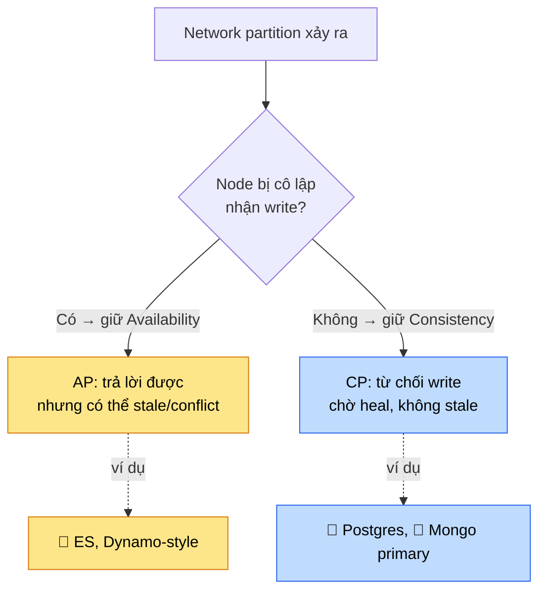
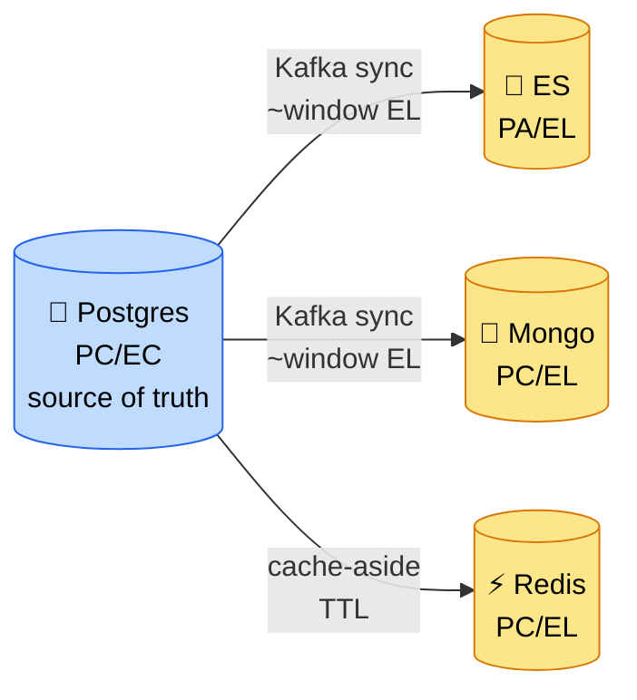

# Lesson 24b — CAP & PACELC in practice

> **Status**: ✅ Done · Day 24
> CAP ai cũng đọc. PACELC mới là chỗ phân biệt senior. Lesson này map 4 storage
> của repo vào PACELC + giải thích vì sao "CP hay AP?" là câu hỏi **thiếu vế**.

---

## 🎯 TL;DR

- **CAP** chỉ nói chuyện **lúc partition** (P): khi mạng đứt giữa các node, hệ chọn
  **C** (consistency) hay **A** (availability). Nhưng partition là chuyện *hiếm*.
- **PACELC** bổ vế còn lại: **E**lse (lúc *không* partition — 99.9% thời gian) hệ
  đánh đổi **L** (latency) lấy **C** (consistency). Đây mới là đánh đổi bạn sống cùng mỗi ngày.
- Đọc đầy đủ: **P**artition → **A** hay **C**; **E**lse → **L** hay **C**.
- Câu "Mongo là CP hay AP?" trả lời đúng là *"tùy config — và quan trọng hơn là vế ELC."*

> 💡 Một câu để nhớ: *CAP là kế hoạch cho ngày bão. PACELC là cách bạn sống ngày nắng.*

---

## 🧩 CAP — và vì sao "chọn 2 trong 3" là cách hiểu sai

Phát biểu phổ biến "chọn 2 trong 3 (C/A/P)" gây hiểu nhầm. Trong distributed system,
**partition là thứ bạn không chọn** — mạng *sẽ* đứt, đó là định luật. Nên P luôn phải gánh.
Câu hỏi thật chỉ là: **khi P xảy ra, hy sinh C hay A?**

- **CP**: lúc partition, thà **từ chối** request còn hơn trả data sai. Postgres primary,
  Mongo primary (write phải tới primary) đi hướng này.
- **AP**: lúc partition, vẫn **nhận/trả** request, chấp nhận stale rồi reconcile sau. ES
  replica vẫn serve search trên data cũ.

---

## 🔑 PACELC — vế mà CAP bỏ quên

> **P**artition? → **A** vs **C**. **E**lse (no partition)? → **L**atency vs **C**onsistency.

Vế **ELC** mới là cái bạn tinh chỉnh hằng ngày: muốn đọc luôn thấy data mới nhất (đọc
từ primary, chậm hơn) hay chấp nhận đọc replica nhanh nhưng có thể trễ vài ms/s?

| Store | Khi **P**artition | Khi **E**lse (no partition) | Nhãn PACELC | Biểu hiện trong repo |
| ----- | ----------------- | --------------------------- | ----------- | -------------------- |
| 🐘 **Postgres** | giữ **C** (CP) | ưu tiên **C** (EC) — đọc primary thấy ngay write | **PC/EC** | order/payment đọc-sau-ghi luôn đúng |
| 🍃 **Mongo** | giữ **C** (write tới primary) | default ưu tiên **L** (EL) — `readPreference=secondary` đọc nhanh nhưng có thể stale | **PC/EL** (tunable bằng read/write concern) | analytics đọc xấp xỉ là OK |
| 🔎 **ES** | thiên **A** (replica vẫn search) | ưu tiên **L** (EL) — refresh ~1s, đọc nhanh trên data gần-realtime | **PA/EL** | search miss item vừa index < 1s |
| ⚡ **Redis** | primary down → fail/failover (CP-ish) | ưu tiên **L** (EL) — replica async, đọc replica có thể stale | **PC/EL** | cache stale chấp nhận được (TTL lo) |

> ⚠️ "Tunable" không phải lời bào chữa. Mongo *có thể* CP/EC nếu set
> `writeConcern=majority` + `readConcern=majority` + đọc primary — nhưng bạn **trả bằng
> latency**. Nói "tùy config" mà không nói cái giá = mất điểm.

---

## 🔬 Tại sao điều này quan trọng cho repo

Cả hệ thống là một bài tập PACELC khổng lồ:

- **Order/payment** chọn **EC** — tiền không được đọc stale. Chấp nhận chậm hơn, đọc
  source of truth (Postgres). Đây là lý do reserve stock đi **sync** (Day 9): eventual
  consistency ở chỗ tiền = trải nghiệm tệ.
- **Search / analytics / cache** chọn **EL** — nhanh quan trọng hơn fresh tuyệt đối. ES
  trễ 1s, cache stale trong TTL, analytics đếm xấp xỉ — đều **chấp nhận có chủ ý**.
- **Eventual consistency window** (Day 9 + Day 22) chính là cái giá của vế **EL**: thời
  gian từ lúc Postgres commit tới lúc ES/Mongo replica thấy. Đo bằng metric, set alert,
  không giả vờ là 0.

> 💡 Insight neo phỏng vấn: **derived store luôn là EL.** Bất cứ thứ gì sync async từ
> source of truth (ES, Mongo read-model, Redis cache) đều hy sinh consistency lấy latency
> — và bạn phải đo cái window đó. Đó là bản chất của polyglot persistence (Day 25).

---

## ⚠️ Cạm bẫy

- **Nhầm "eventual consistency" với "không consistency".** Eventual = *sẽ* hội tụ, có
  window đo được; không phải "data sai mãi mãi".
- **Tưởng Postgres "miễn nhiễm CAP".** Single-node thì không có P để mà bàn. Nhưng
  Postgres + read replica = ngay lập tức có vế EL (đọc replica = stale). Replica không free.
- **Quote CAP để biện minh chọn NoSQL.** "NoSQL chọn AP nên scale tốt" — sai; nhiều NoSQL
  (Mongo, HBase) là CP. CAP không map 1-1 vào SQL/NoSQL.
- **Bỏ qua vế ELC.** 99.9% thời gian không có partition. Nếu chỉ nói CAP, bạn bỏ qua đánh
  đổi mình thực sự sống cùng.

---

## 🎤 Trả lời phỏng vấn

**Q: "MongoDB là CP hay AP?"**
> Mặc định **CP** ở vế partition — write phải tới primary, partition thì secondary không
> nhận write. Nhưng câu hỏi thiếu vế: theo PACELC, Mongo là **PC/EL** — lúc bình thường nó
> ưu tiên latency (đọc secondary nhanh, có thể stale). Em có thể kéo về EC bằng
> `writeConcern=majority` + đọc primary, nhưng trả bằng latency. Trong project em để
> analytics ở EL vì đếm xấp xỉ là đủ.

**Follow-up trap: "Vậy Postgres có dính CAP không?"**
> Single-node thì P không xảy ra nên CAP vô nghĩa. Nhưng khi thêm read replica để scale
> đọc, em ngay lập tức có vế EL — đọc replica là stale. Lúc đó em phải quyết: read nào
> đọc primary (EC, vd đọc lại order vừa tạo), read nào đọc replica (EL, vd list sản phẩm).

---

## 🔗 Related

- Lesson: [24 — Decision matrix](24-sql-vs-nosql-vs-es-decision-matrix.md) · [04b — Transaction isolation](04b-transaction-isolation.md) · [09b — Eventual consistency window](09b-eventual-consistency-window.md)
- Issue: [22 — ES/Postgres sync drift](../issues/22-es-postgres-sync-drift.md) · [23 — Mongo no-transaction trap](../issues/23-mongodb-no-transaction-trap.md)
- Interview: [day-24 — Storage decisions](../interview/day-24-storage-decisions.md)
</content>
