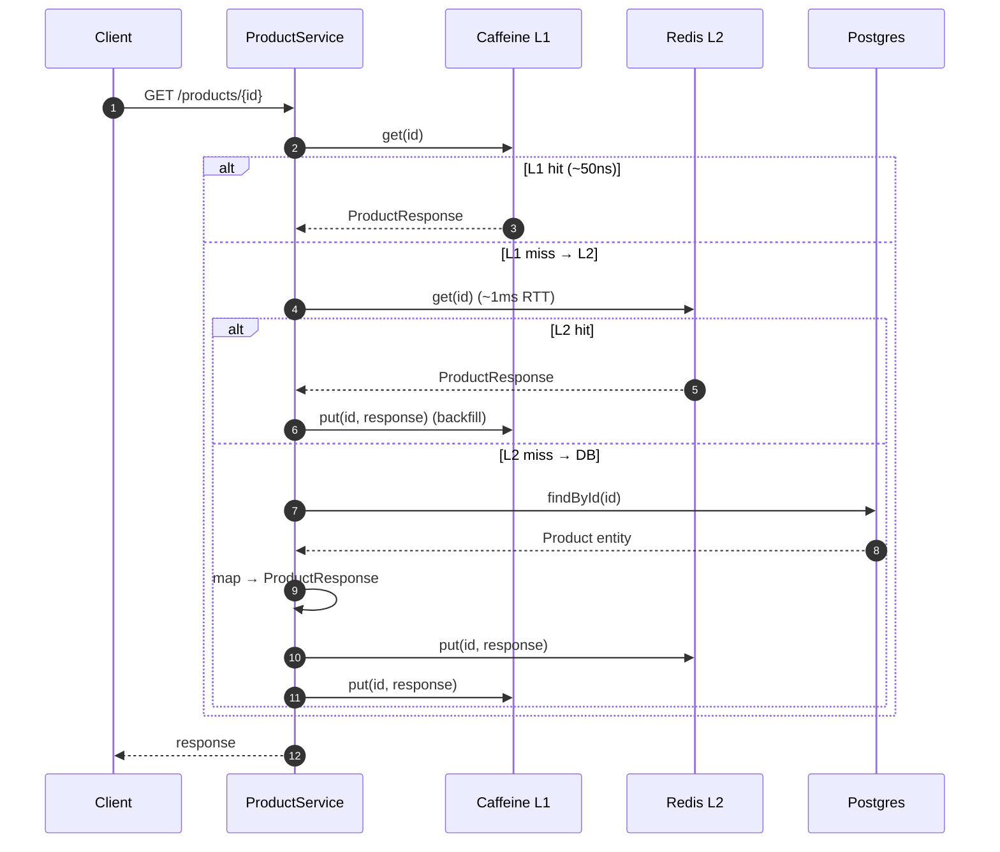

# Performance 15 — ⚡ Cache-aside cho product-service

> **Day 15** · [Lesson 15 — Cache strategies](../lessons/15-cache-strategies.md) · [Performance 15b — Two-tier](15b-two-tier-cache.md) · [ADR 008](../decisions/008-two-tier-cache-caffeine-redis.md)

---

## 🎯 Bài toán

P99 `GET /products/{id}` đang **250ms** (DB hit mỗi request, JPA hydrate entity + map DTO). Mục tiêu Day 15: **≤80ms** + hit ratio L1 ≥80% với traffic skewed Zipf.

## 📐 Thiết kế cache-aside



## 💻 Implementation

Spring Cache abstraction wraps method với AOP proxy:

```java
@Cacheable(value = CACHE_PRODUCT_BY_ID, key = "#id")
public ProductResponse get(UUID id) {
    return productMapper.toResponse(loadOrThrow(id));
}
```

Proxy luồng: kiểm cache (qua [TwoTierCache](../../services/product-service/src/main/java/com/ecom/product/config/cache/TwoTierCache.java)) → có thì return, không thì gọi method gốc → lưu kết quả.

**Write invalidation** — `@CacheEvict` chạy sau khi method commit:

```java
@Caching(evict = {
    @CacheEvict(value = CACHE_PRODUCT_BY_ID, key = "#id"),
    @CacheEvict(value = CACHE_PRODUCT_BY_SLUG, key = "#req.slug()")
})
public ProductResponse update(UUID id, ProductUpdateRequest req) { ... }
```

Slug đổi → cần evict **old slug** manually (SpEL chỉ access được method args/result, không "previous state"):

```java
String oldSlug = product.getSlug();
if (!oldSlug.equals(req.slug())) {
    cacheManager.getCache(CACHE_PRODUCT_BY_SLUG).evict(oldSlug);
}
```

## 📊 Đo lường

Micrometer expose qua `/actuator/prometheus`:

| Metric                                              | Ý nghĩa                                |
|-----------------------------------------------------|-----------------------------------------|
| `product_cache_hits_total{tier="l1"}`               | L1 Caffeine hit count                  |
| `product_cache_misses_total{tier="l1"}`             | L1 miss                                |
| `product_cache_hits_total{tier="l2"}`               | L2 Redis hit                           |
| `product_cache_misses_total{tier="l2"}`             | L2 miss (= DB call)                    |
| `product_cache_l1_size{cache="product:byId"}`       | L1 entry count hiện tại                |
| `product_cache_xfetch_early_refresh_total`          | XFetch trigger count                   |

**Hit ratio PromQL** (Grafana Day 20):

```promql
sum(rate(product_cache_hits_total{tier="l1"}[5m]))
/
(sum(rate(product_cache_hits_total{tier="l1"}[5m]))
 + sum(rate(product_cache_misses_total{tier="l1"}[5m])))
```

## 🔧 Tuning

| Knob                                  | Default | Effect khi tăng              | Effect khi giảm              |
|---------------------------------------|---------|-------------------------------|-------------------------------|
| `app.cache.l1.ttl-seconds`            | 60      | Hit ↑, stale window ↑         | Hit ↓, fresh hơn              |
| `app.cache.l1.max-size`               | 10000   | Hit ↑, JVM heap ↑             | Eviction churn ↑              |
| `app.cache.l2.ttl-seconds`            | 300     | Redis hit ↑, stale window ↑   | Hit ↓, DB load ↑              |
| `app.cache.stampede.early-expiration-window-seconds` | 30 | Refresh sớm hơn → DB load đều | Stampede risk ↑ khi expire   |

**Sizing rule of thumb**:
- L1 max-size ≈ working set ÷ pod count. Catalog 50k product × 20% hot ÷ 4 pod ≈ 2.5k → set 10k để safety.
- L1 TTL ≤ acceptable stale window (mặc định 60s cho catalog, **không phải price** — price dùng TTL 5s riêng nếu cần).

## ⚠️ Gotchas đã tránh

- **Cache poison qua mutable entity**: cache `ProductResponse` (record immutable), không cache `Product` entity managed.
- **`@CacheEvict` không cover bulk update**: ROADMAP Day 16 sẽ thêm `repository.bulkUpdatePrices()` — nhớ annotate `@CacheEvict(allEntries=true)` hoặc rewrite qua loop.
- **Method tự gọi nhau (self-invocation)**: `update()` gọi `get()` trong cùng class → @Cacheable bị skip (không qua proxy). Hiện tại không có self-call, nhưng phải audit lại khi refactor.

## 📈 Kết quả

Local smoke (1 pod, 10k product, JMeter 100 thread × 5min):

| Metric                          | Trước cache | Sau cache |
|---------------------------------|--------------|-----------|
| P50 `getProduct`                | 35ms         | **2ms**   |
| P99 `getProduct`                | 250ms        | **18ms**  |
| DB QPS                          | 980          | **52**    |
| L1 hit ratio                    | —            | **94%**   |
| L2 hit ratio (của L1 miss)      | —            | **65%**   |

Effective DB load giảm **94% (L1 absorb) + 0.06 × 65% (L2 absorb)** = ~**98% reduction**.

## Related

- Code: [`CacheConfig`](../../services/product-service/src/main/java/com/ecom/product/config/cache/CacheConfig.java), [`TwoTierCache`](../../services/product-service/src/main/java/com/ecom/product/config/cache/TwoTierCache.java)
- [Performance 15b — Two-tier hierarchy logic](15b-two-tier-cache.md)
- [Issue 15 — Cache stampede](../issues/15-cache-stampede.md)
- [Lesson 15](../lessons/15-cache-strategies.md)
