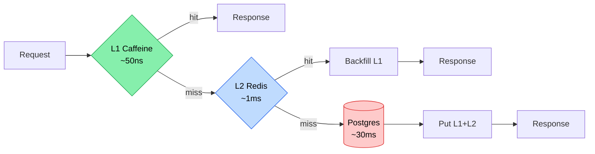

# Performance 15b — ⚡ Two-tier Cache (Caffeine L1 + Redis L2)

> **Day 15** · [Performance 15 — Cache aside](15-cache-aside.md) · [ADR 008](../decisions/008-two-tier-cache-caffeine-redis.md)

---

## 🎯 Tại sao 2-tier không phải 1-tier

| Single Redis        | Single Caffeine        | **2-tier (Caffeine + Redis)**            |
|----------------------|------------------------|------------------------------------------|
| 1ms RTT mỗi hit     | ~50ns mỗi hit          | ~50ns L1 hit, 1ms L2 hit on L1 miss     |
| Bandwidth bottleneck | Multi-instance inconsistent | Bandwidth giảm 80-95%, instance share via L2 |
| Round trip cost      | Restart = mất cache    | Cold start vẫn warm từ L2               |

L1 là **CPU register** của cache layer; L2 là **RAM**. Truy cập tuần tự L1→L2→DB cho latency ladder mượt: 50ns → 1ms → 30ms.

## 📊 Hierarchy logic



## 🧠 Quan hệ TTL hai tier

```
L1 TTL (60s)  ≤  L2 TTL (300s)
```

**Tại sao L1 TTL ngắn hơn?** Multi-instance: instance A update DB + evict L1 + evict L2. Instance B's L1 KHÔNG được notify (chưa có pub/sub) → còn cache cũ. Trong vòng L1 TTL (≤60s), B sẽ thấy stale; sau đó B's L1 expire → đọc L2 (đã được A evict → DB) → fresh. Chọn L1 TTL nhỏ = staleness window nhỏ.

**Tại sao L2 TTL dài?** L2 chỉ stale khi explicit evict miss (vd app crash giữa update → DB committed nhưng evict không chạy). L2 TTL là safety net cho case hiếm này. Đủ lớn để hit ratio cao + đủ nhỏ để worst-case stale không kéo dài.

## 💻 Implementation

### Stack composition

```
ProbabilisticExpiringCache (XFetch decorator)
  └─→ TwoTierCache
        ├─→ L1: Caffeine native cache
        └─→ L2: Spring RedisCache (via RedisCacheManager)
```

### Read flow (TwoTierCache.lookup)

```java
protected Object lookup(Object key) {
    Object l1Value = l1.getIfPresent(key);
    if (l1Value != null) { l1Hits.increment(); return l1Value; }
    l1Misses.increment();

    Object l2Value = l2.get(key, () -> null);
    if (l2Value != null) {
        l2Hits.increment();
        l1.put(key, l2Value);  // backfill
        return l2Value;
    }
    l2Misses.increment();
    return null;
}
```

### Write flow

```java
public void put(Object key, Object value) {
    l2.put(key, value);  // L2 first
    l1.put(key, value);
}

public void evict(Object key) {
    l2.evict(key);  // L2 first — quan trọng
    l1.invalidate(key);
}
```

**Tại sao evict L2 TRƯỚC L1?** Nếu L1 evict thành công nhưng L2 fail (Redis down), instance khác vẫn fetch L2 stale → backfill L1 stale lần sau → stale propagate. Evict L2 trước → worst case L1 còn stale ≤TTL, KHÔNG bị restore từ L2 stale.

## 🔧 Caffeine vs vanilla LRU

Caffeine dùng **W-TinyLFU** eviction (Window-TinyLFU) — hit ratio gần optimal trên benchmark Yahoo/Wikipedia traces, cao hơn LRU vanilla 10-30%. Lý do: LRU thrash với scan pattern (1 sequence read kéo hot data ra ngoài); W-TinyLFU dùng frequency sketch chống scan.

JVM heap impact: 10k entry × ~500 bytes (ProductResponse JSON serialize) ≈ 5 MB. Negligible cho heap 2-4 GB.

## ⚠️ Multi-instance pitfall

L1 KHÔNG share giữa pod. 4 pod = 4 L1 cache độc lập. Invalidation propagation:

```
Pod A: update DB + evict L1_A + evict L2
Pod B: vẫn cache L1_B (stale) cho tới khi expire
```

**Mitigation hiện tại (Day 15)**: TTL 60s = stale window ≤60s. Acceptable cho catalog (product update không thường xuyên).

**Mitigation Day 20+**: Redis pub/sub `cache:invalidate` channel. Pod A publish key → tất cả pod subscribe → evict L1 local.

```java
// Future Day 20+ pseudocode
redisTemplate.convertAndSend("cache:invalidate", "product:byId:" + id);

@RedisListener(channels = "cache:invalidate")
void onInvalidate(String key) {
    String[] parts = key.split(":");
    Cache cache = cacheManager.getCache(parts[0] + ":" + parts[1]);
    if (cache != null) cache.evict(parts[2]);
}
```

## 📈 Hit ratio math

Workload Zipf α=1 trên 50k product:
- Top 20% (10k product) = 80% traffic ("hot")
- L1 size 10k → cover 100% hot → L1 hit ≈ 80%
- Remaining 20% traffic vào L2 → L2 cover toàn bộ 50k (Redis có headroom) → L2 hit ≈ 95% trong 20%
- Effective DB load = 20% × 5% = **1%** (vs 100% no cache)

## Related

- Code: [`TwoTierCache.java`](../../services/product-service/src/main/java/com/ecom/product/config/cache/TwoTierCache.java)
- [Performance 15 — Cache aside basic](15-cache-aside.md)
- [Issue 15 — Stampede protection](../issues/15-cache-stampede.md)
- [Issue 15b — Hot key sharding](../issues/15b-hot-key.md)
- [ADR 008 — Decision rationale](../decisions/008-two-tier-cache-caffeine-redis.md)
