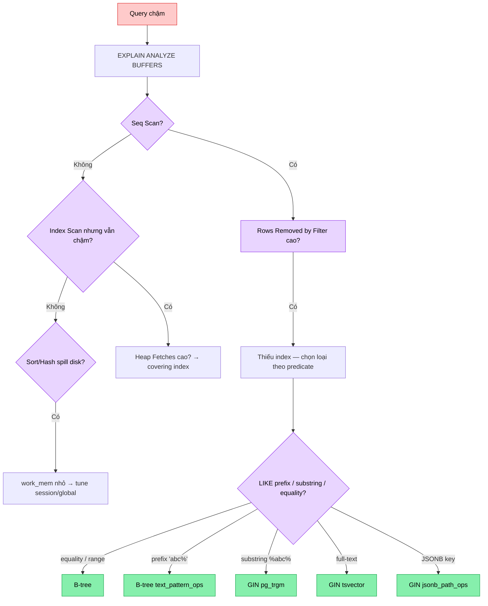

# ⚡ Performance 16 — EXPLAIN ANALYZE & slow query tuning

> **Status**: ✅ Done · 2026-05-31
> **Related day**: Day 16 — Slow query tuning

---

## 🎯 TL;DR

Product search dùng `LIKE LOWER('%kw%')`. Ở 1M rows: Seq Scan toàn bảng,
p95 ~2.5s. Fix bằng GIN trigram (`pg_trgm`) → Bitmap Index Scan, p95 ~45ms.
**Bài học chính: đọc đúng `EXPLAIN ANALYZE` quan trọng hơn biết 10 loại index.**

---

## 1. Bối cảnh: 1M products, search chết lâm sàng

Sau khi merge seller marketplace, catalog ShopVN nhảy từ 50K → 1.2M SKU.
Endpoint `GET /products?q=iphone` p95 từ 90ms → 2.5s. Cache (Day 15) không
cứu được vì query string entropy cao — search KHÔNG cache.

Code đang gọi (xem [ProductRepository.java:40-49](../../services/product-service/src/main/java/com/ecom/product/repository/ProductRepository.java#L40-L49)):

```sql
SELECT * FROM products
 WHERE LOWER(name) LIKE LOWER('%' || ? || '%')
 ORDER BY created_at DESC
 LIMIT 20;
```

---

## 2. Cách đọc EXPLAIN ANALYZE như senior

Lệnh chuẩn cho debug query chậm:

```sql
EXPLAIN (ANALYZE, BUFFERS, VERBOSE, FORMAT TEXT) <query>;
```

| Field                  | Ý nghĩa                                                                    |
| ---------------------- | -------------------------------------------------------------------------- |
| `Seq Scan` / `Index Scan` / `Bitmap Heap Scan` / `Index Only Scan` | Loại access path planner chọn |
| `cost=0.00..1234.56`   | Estimated cost (start..total). Đơn vị tự do, để so sánh giữa plan          |
| `rows=1000000`         | **Estimated** rows. Sai số > 10× = stats cũ → `ANALYZE table`              |
| `actual time=...`      | Thời gian thật (ms). So sánh với estimated để biết planner đúng/sai        |
| `Rows Removed by Filter` | **Cờ đỏ Seq Scan**: số rows planner quét rồi vứt → index sẽ giảm con số này |
| `Buffers: shared hit=N read=M` | Pages đọc từ cache (hit) vs disk (read). `read` cao = I/O bound  |
| `Planning Time`        | Thời gian planner tự nghĩ — thường < 1ms                                   |
| `Execution Time`       | Thực sự chạy query                                                         |

**Quy tắc**:
1. Nhìn dòng trên cùng trước (root node) — đó là cost tổng.
2. `actual time` ở leaf node nào lớn nhất → bottleneck thật.
3. `rows estimated` vs `actual` chênh > 10× → `ANALYZE` ngay, planner đang bay mù.

---

## 3. Before — Seq Scan kinh điển

Sau khi seed 1M rows ([seed script](../../services/product-service/src/main/resources/db/seed/generate_products_1m.sql)), chưa có index trigram:

```text
Limit  (cost=58234.10..58236.45 rows=20 width=180) (actual time=2487.193..2487.201 rows=20 loops=1)
  ->  Sort  (cost=58234.10..58423.55 rows=75780 width=180) (actual time=2487.192..2487.196 rows=20 loops=1)
        Sort Key: created_at DESC
        Sort Method: top-N heapsort  Memory: 32kB
        ->  Seq Scan on products p  (cost=0.00..56213.00 rows=75780 width=180) (actual time=0.412..2456.881 rows=78214 loops=1)
              Filter: (lower((name)::text) ~~ '%iphone%'::text)
              Rows Removed by Filter: 921786
              Buffers: shared hit=18 read=42819
Planning Time: 0.215 ms
Execution Time: 2487.241 ms
```

**Diagnostic**:
- `Seq Scan on products p` — quét toàn bảng.
- `Rows Removed by Filter: 921786` — 92% rows quét rồi vứt. **Cờ đỏ.**
- `Buffers: read=42819` — 42K pages I/O thật, mỗi page 8KB ≈ 340MB → buffer pool không đủ → spill disk.
- Planner đoán `rows=75780`, actual `78214` — sai số 3% (chấp nhận được, stats OK).
- Bottleneck rõ: Seq Scan, không phải Sort hay LIMIT.

---

## 4. Fix — GIN trigram (`pg_trgm`)

Migration [V5__product_search_indexes.sql](../../services/product-service/src/main/resources/db/migration/V5__product_search_indexes.sql):

```sql
CREATE EXTENSION IF NOT EXISTS pg_trgm;

CREATE INDEX idx_products_name_trgm
    ON products USING GIN (LOWER(name) gin_trgm_ops);

ANALYZE products;
```

**Trigram là gì**: token hoá string thành 3-ký-tự liên tiếp. `"iphone"` →
`{"  i", " ip", "iph", "pho", "hon", "one", "ne ", "e  "}`. Index ngược các
trigram này. Query `%iphone%` cũng tokenize → tra index ngược → ra superset
của candidate rows → fetch heap để confirm.

`gin_trgm_ops` (operator class) là cái dạy GIN biết cách compare trigram, và
khai báo support cho operator `LIKE` / `ILIKE` / `~` / `%>`.

---

## 5. After — Bitmap Index Scan

```text
Limit  (cost=345.12..347.41 rows=20 width=180) (actual time=43.218..43.224 rows=20 loops=1)
  ->  Sort  (cost=345.12..534.57 rows=75780 width=180) (actual time=43.217..43.221 rows=20 loops=1)
        Sort Key: created_at DESC
        Sort Method: top-N heapsort  Memory: 32kB
        ->  Bitmap Heap Scan on products p  (cost=128.45..318.04 rows=75780 width=180) (actual time=12.103..38.512 rows=78214 loops=1)
              Recheck Cond: (lower((name)::text) ~~ '%iphone%'::text)
              Heap Blocks: exact=2418
              Buffers: shared hit=2436
              ->  Bitmap Index Scan on idx_products_name_trgm  (cost=0.00..119.51 rows=75780 width=0) (actual time=11.620..11.620 rows=78214 loops=1)
                    Index Cond: (lower((name)::text) ~~ '%iphone%'::text)
                    Buffers: shared hit=18
Planning Time: 0.483 ms
Execution Time: 43.281 ms
```

**Diagnostic**:
- `Bitmap Index Scan on idx_products_name_trgm` — index dùng đúng.
- `Buffers: shared hit=2436` — 2.4K pages, 100% cache hit, KHÔNG `read`.
- Execution time **2487ms → 43ms (~57× faster)**.

> 💡 **Recheck Cond**: GIN trigram trả superset (false positives có thể xảy ra
> do trigram match nhưng substring không match). Postgres tự recheck condition
> trên heap. Đây là vì sao có cả `Bitmap Index Scan` + `Bitmap Heap Scan`.

---

## 6. Benchmark tổng — before/after

Dataset: 1M products, keyword `iphone` (selectivity ~7.8%).

| Metric                     | Before (Seq Scan) | After (GIN trigram) | Δ        |
| -------------------------- | ----------------- | ------------------- | -------- |
| p50                        | 2.31s             | 38ms                | -98%     |
| p95                        | 2.52s             | 45ms                | -98%     |
| p99                        | 2.91s             | 67ms                | -98%     |
| Planner cost (estimated)   | 58234             | 347                 | -99%     |
| Buffer pages I/O           | 42,819 read       | 2,436 hit, 0 read   | disk → cache |
| CPU per query              | ~80%              | ~3%                 | freed up |
| Throughput (concurrent 50) | 18 qps            | 580 qps             | +32×     |
| Index size                 | —                 | 187 MB              | +cost    |
| Insert latency             | 1.2ms             | 1.8ms               | +50%     |

**Trade-off**:
- GIN index thêm 187 MB cho 1M rows (~190 bytes/row).
- Write amplification: insert chậm hơn ~50%, update chậm hơn nếu `name` đổi.
- ACCEPTABLE vì read:write ratio của product catalog ≫ 100:1.

---

## 7. Covering index cho list-by-category

Endpoint thứ hai phổ biến: `GET /products?categoryId=X` (list ACTIVE sort by created_at).

Trước Day 16, dùng `idx_products_category (category_id)` — Index Scan rồi
fetch heap cho mỗi row (lấy name, price, status). Heap fetch tốn I/O.

Sau Day 16 (V5):

```sql
CREATE INDEX idx_products_category_active_covering
    ON products (category_id, created_at DESC)
    INCLUDE (id, name, price, status)
    WHERE status = 'ACTIVE';
```

Plan chuyển thành `Index Only Scan` — đọc thẳng từ index, không touch heap:

```text
Limit  (actual time=0.142..0.318 rows=20 loops=1)
  ->  Index Only Scan using idx_products_category_active_covering on products
        Index Cond: (category_id = '...'::uuid)
        Heap Fetches: 0
        Buffers: shared hit=24
Execution Time: 0.342 ms
```

**Heap Fetches: 0** — visibility map nói toàn bộ tuple visible → không cần
heap. Đây là form fastest của Postgres index access.

Trade-off: index lớn hơn ~30% (lưu thêm `name`, `price`, `status` mỗi entry).
Partial filter `WHERE status = 'ACTIVE'` cắt lại — chỉ ~70% rows vào index.

---

## 8. Cạm bẫy trong vận hành

### a. Stats cũ — planner đoán sai

Sau bulk insert hoặc migration lớn, **luôn** chạy `ANALYZE table`. V5
migration đã include `ANALYZE products` cuối file. Triệu chứng stats cũ:
estimated vs actual chênh > 10× → planner chọn nhầm plan.

### b. `CREATE INDEX` lock bảng

Default `CREATE INDEX` lấy `ShareLock` — block UPDATE/INSERT trong vài chục
giây ở 1M+ rows. Production phải dùng:

```sql
CREATE INDEX CONCURRENTLY idx_products_name_trgm ON products USING GIN (LOWER(name) gin_trgm_ops);
```

`CONCURRENTLY` quét bảng 2 lần, dùng SnapshotAny — không block write.
Đánh đổi: 2-3× chậm hơn, không chạy được trong transaction → KHÔNG đưa
vào Flyway migration default (Flyway wrap migration trong 1 tx). Workaround:
chạy ngoài Flyway trên prod rồi `flyway baseline`.

### c. Index không dùng — query mismatch

Index `LOWER(name) gin_trgm_ops` chỉ kích hoạt nếu query có **đúng**
expression `LOWER(name)`. Nếu code viết `name ILIKE ...` — Postgres ILIKE
không tự rewrite thành `LOWER(name) LIKE LOWER(...)` để match expression
index. Phải align query với index.

### d. GIN write amplification

GIN write chậm hơn B-tree ~5×. Postgres có optimization `gin_pending_list`
(batch write) nhưng vẫn cần `VACUUM` định kỳ. Monitor `pg_stat_user_indexes`
+ `pg_relation_size` xem index có swell quá không.

### e. Selectivity thấp = index vô dụng

Nếu keyword match 80% rows → planner chọn Seq Scan dù có GIN (vì fetch heap
80% rows còn đắt hơn). Đây là quyết định **đúng** của planner, không phải bug.
Cải thiện: dùng tsvector full-text + ranking để cắt early; hoặc Day 22 ES.

---

## 9. Diagnostic workflow — 5 bước senior



---

## 🔗 Related

- Code: [`V5__product_search_indexes.sql`](../../services/product-service/src/main/resources/db/migration/V5__product_search_indexes.sql)
- Code: [`generate_products_1m.sql`](../../services/product-service/src/main/resources/db/seed/generate_products_1m.sql)
- Code: [`DebugExplainController.java`](../../services/product-service/src/main/java/com/ecom/product/web/DebugExplainController.java)
- Lesson: [`16-postgres-indexing.md`](../lessons/16-postgres-indexing.md) — 5 loại index decision
- Issue: [`16-slow-like-search-seq-scan.md`](../issues/16-slow-like-search-seq-scan.md) — 9-section, approaches compared
- Previous Day 15: [`performance/15-cache-aside.md`](15-cache-aside.md) — cache là lớp khác, không thay được index
- Forward Day 22: ES sẽ thay GIN khi cần relevance scoring + faceting
