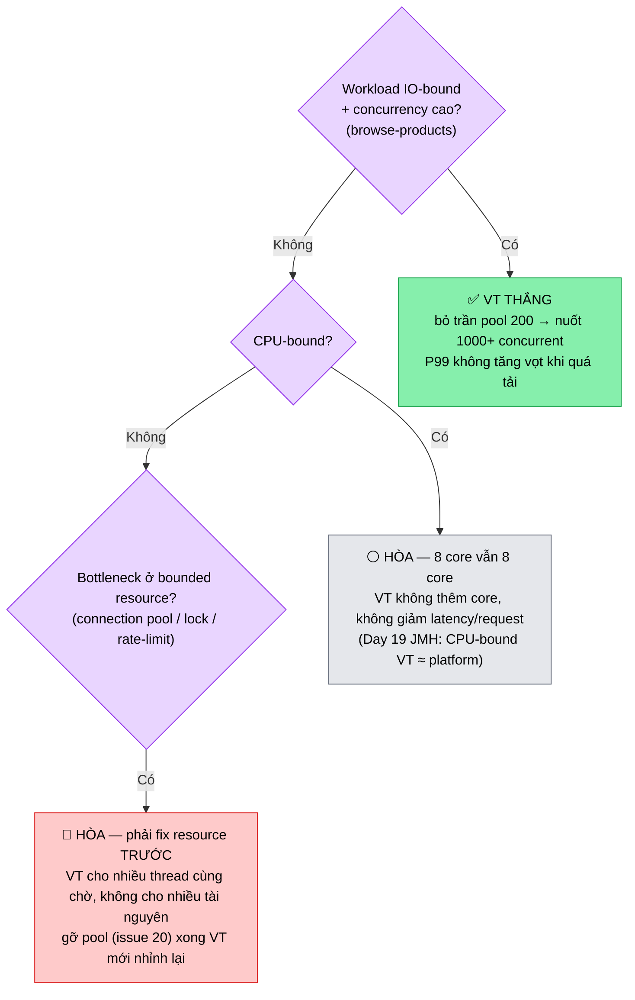

# ⚡ Performance 20b — Virtual Threads vs Platform Threads under load

> Day 19 đo VT ở tầng **micro** (JMH, `concurrency-lab`). Day 20 đo ở tầng
> **end-to-end** (HTTP → DB → Kafka outbox) dưới tải k6. Hai tầng kể 2 nửa
> của cùng 1 sự thật: **VT tăng concurrency, KHÔNG tăng tốc từng request.**

---

## 🎯 Câu hỏi

"Bật virtual thread thì app nhanh hơn bao nhiêu?" — câu hỏi **sai đề**. Câu
đúng: *"Với workload nào VT tăng throughput, với workload nào hòa, và bottleneck
thật nằm ở đâu?"*

## 🧪 Thiết kế thí nghiệm

Chạy cùng 1 k6 scenario 2 lần, chỉ đổi profile order-service:

| Profile | Config | Thread model |
| --- | --- | --- |
| `vt` (default) | `spring.threads.virtual.enabled=true` | mỗi request 1 virtual thread (rẻ, ~vài KB) |
| `platform` | `application-platform.yml`: VT off, Tomcat pool 200 | tối đa 200 platform thread (mỗi ~1MB stack) |

2 workload:
- **browse-products** (read-heavy, IO-bound, cache-hot) — nơi VT toả sáng nhất.
- **place-order** (write-heavy, vướng connection pool) — nơi VT bị che bởi bottleneck khác.

## 📊 Kết quả kỳ vọng + cách diễn giải

> Điền số thật sau khi chạy (template ở [`20-load-test-report-template.md`](20-load-test-report-template.md)).
> Dưới là **mô hình kỳ vọng** + cách đọc — học để giải thích, không phải để chép số.

### Read-heavy (browse-products)

| Metric | VT | Platform-200 | Giải thích |
| --- | --- | --- | --- |
| Max throughput | **cao hơn** | trần ~200 concurrent | Read block ngắn ở Redis/DB; platform cap 200 thread → request thứ 201 xếp hàng ở Tomcat. VT không cap → nuốt 1000+ concurrent. |
| P99 lúc quá tải platform | thấp | **tăng vọt** | Khi vượt 200, platform queue ở accept-count → latency. VT mỗi request 1 thread, không queue thread-level. |
| `jvm_threads_live` | thấp (~carrier) | ~200 | Dấu hiệu phân biệt rõ nhất. |

→ **VT thắng rõ** cho IO-bound concurrency cao. Đây là use case Loom sinh ra để giải.

### Write-heavy (place-order)

| Metric | VT | Platform-200 | Giải thích |
| --- | --- | --- | --- |
| Max throughput | **≈ hòa** | ≈ | Cả hai bị chặn bởi **connection pool 20** (issue 20), không phải số thread. VT cho nhiều thread hơn nhưng tất cả xếp hàng chờ connection. |
| P99 | cao (chờ pool) | cao (chờ pool) | Bottleneck là tài nguyên bounded phía sau, VT không gỡ được. |
| `hikaricp_pending` | leo cao | leo cao | Bằng chứng bottleneck dời sang pool. |

→ **VT hòa** — không phải VT vô dụng, mà bottleneck nằm ở chỗ khác. Gỡ pool
(issue 20) thì cả hai cùng tăng, và VT lại nhỉnh hơn nhờ không tốn thread chờ.

## 🧠 Vì sao — bản chất

VT giải đúng **một** vấn đề: thread platform **đắt** (1MB stack, OS-scheduled),
nên ta phải gom vào pool (200) → pool thành trần concurrency. VT rẻ → bỏ trần đó.

Nhưng VT **không** đụng tới:
- **CPU-bound work**: 8 core vẫn là 8 core. VT không thêm core (Day 19 JMH:
  CPU-bound VT ≈ platform).
- **Tài nguyên bounded**: connection pool, rate limit downstream, lock. VT cho
  nhiều thread *cùng chờ*, không cho nhiều tài nguyên.
- **Latency mỗi request**: 1 query 40ms vẫn 40ms. VT tăng *bao nhiêu request
  song song*, không giảm thời gian *từng cái*.

> 💡 **Senior vs junior**: junior nói "bật VT cho nhanh". Senior nói "VT tăng
> throughput cho **IO-bound concurrency cao**; với CPU-bound hoặc bottleneck ở
> tài nguyên bounded thì hòa — và đo bằng số chứ không assume".

> ⚠️ **Pinning** (Day 19): VT block trong `synchronized` hoặc native sẽ **ghim**
> carrier thread → mất hết lợi ích VT. Đã verify bằng JFR `jdk.VirtualThreadPinned`
> ở Day 19; với Java 21 cần đổi `synchronized` → `ReentrantLock` ở hot path block.
> (Java 24+ gỡ giới hạn này.)

## 🌳 Decision tree — "Virtual Thread có giúp không?"

Trước khi bật VT để "cho nhanh", chạy qua cây quyết định này — kết luận khớp đúng benchmark Day 19 (JMH) + Day 20 (k6) ở trên.

## ✅ Kết luận hành động

1. Giữ VT làm default — chi phí ~0, lợi cho read path.
2. **Đừng** kỳ vọng VT cứu write path đang nghẽn pool → fix pool trước (issue 20).
3. Luôn đo 2 mode để có số nói chuyện phỏng vấn ("VT tăng X% throughput read,
   hòa ở write vì pool — fix pool xong tăng Y%").

---

## 🔗 Related

- Micro-bench (cùng câu hỏi, tầng JMH): Day 19 [`concurrency-lab`](../../concurrency-lab)
- Bottleneck: [`issues/20-connection-pool-exhaustion-under-vt.md`](../issues/20-connection-pool-exhaustion-under-vt.md)
- Methodology: [`lessons/20-load-testing-methodology.md`](../lessons/20-load-testing-methodology.md)
- Profile config: [`application-platform.yml`](../../services/order-service/src/main/resources/application-platform.yml)
