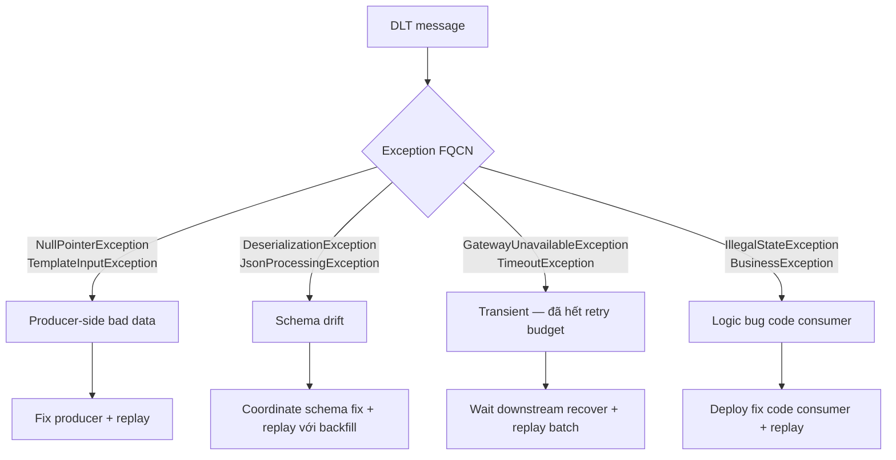

# 🔧 Runbook — Kafka DLT recovery

> **Audience**: ops oncall + backend developer.
> **Trigger**: alert `notification.dlt.count > 0` 5min window, hoặc `kafka_consumer_lag` spike.
> **Estimated time**: 15-45 phút tùy classification.
> **Owner**: backend platform team.

---

## 🎯 Mục tiêu

Khi message vào DLT, đảm bảo: (1) **không mất data**, (2) **không infinite replay loop**, (3) **post-mortem ghi nhận**.

---

## Bước 1 — Triage (≤ 5 phút)

Mục tiêu: xác định scope + severity.

```bash
# Check DLT topic count
kafka-run-class kafka.tools.GetOffsetShell \
  --broker-list kafka:9092 \
  --topic order.created.DLT --time -1
# → "order.created.DLT:0:1234" = 1234 message trong partition 0

# Check Grafana panel "notification.dlt.count by original_topic" — biểu đồ rate
# Check ServiceNow / Sentry — có incident producer side không?
```

**Severity matrix**:

| DLT count | Action                                    |
| --------- | ----------------------------------------- |
| 1-10      | Low — investigate trong sprint, không page |
| 10-1000   | Medium — page DRI, fix trong 4h           |
| >1000     | High — page DRI ngay + war room, có thể là producer bug rolling |

## Bước 2 — Inspect payload (5-10 phút)

Dump 10 message gần nhất từ DLT:

```bash
kafka-console-consumer --bootstrap-server kafka:9092 \
  --topic order.created.DLT \
  --from-beginning --max-messages 10 \
  --property print.headers=true \
  --property print.key=true
```

Đọc các header Spring Kafka inject sẵn:
- `kafka_dlt-original-topic` — topic gốc
- `kafka_dlt-exception-fqcn` — class exception
- `kafka_dlt-exception-message` — message
- `kafka_dlt-exception-stacktrace` — full stack
- `kafka_dlt-original-offset`, `kafka_dlt-original-partition` — để replay

Lưu sample payload vào ticket/incident doc.

## Bước 3 — Classify (5-15 phút)



| Class                       | Root cause              | Recovery action                              |
| --------------------------- | ----------------------- | -------------------------------------------- |
| **Bad data** (producer)     | Producer publish payload sai | Fix producer code → deploy → replay DLT      |
| **Schema drift**            | Field rename, breaking change | Schema registry update + dual-publish + replay |
| **Transient lingering**     | Downstream chậm phục hồi | Wait + verify downstream healthy → replay    |
| **Consumer code bug**       | Logic sai khi xử lý     | Fix code → deploy → replay                   |

**KHÔNG replay khi chưa classify** — replay vào code chưa fix = DLT lại = infinite loop.

## Bước 4 — Replay hoặc discard (10-30 phút)

### Option A — Replay từ DLT về topic gốc

Sử dụng script idempotent (consumer phải có dedup — Day 10 + Day 12 pattern):

```bash
# Tool: kcat (formerly kafkacat) hoặc Confluent Replicator
kcat -b kafka:9092 -t order.created.DLT -e -K \| | \
  while IFS='|' read key value; do
    echo "$value" | kcat -b kafka:9092 -t order.created -k "$key" -P
  done
```

**Chú ý**:
- Replay vào cùng partition gốc (dùng cùng key) → giữ ordering.
- Consumer dedup (Redis SET NX) phải chưa expire — Day 12 TTL 24h → replay phải trong 24h kể từ original event.
- Nếu quá TTL → release dedup manual hoặc accept duplicate dispatch (notification = low risk).

### Option B — Discard (mất chấp nhận được)

```bash
# Reset DLT consumer group offset về end
kafka-consumer-groups --bootstrap-server kafka:9092 \
  --group notification-dlt \
  --topic order.created.DLT \
  --reset-offsets --to-latest --execute
```

Dùng cho: data đã quá old (>7 ngày), business event không critical, hoặc đã có alternative recovery (vd payment reconciliation Day 36 sẽ catch).

## Bước 5 — Post-mortem (1 tuần sau)

Bắt buộc append vào [`docs/leadership/incidents.md`](../leadership/incidents.md) nếu có thật:
- Timeline (detect → triage → fix → replay → resolved)
- Root cause (5 whys)
- Prevention (test, alert, contract — gì sẽ catch lần sau)
- Action items với owner + due date

---

## 🚨 Anti-patterns (KHÔNG làm)

1. **Auto-replay DLT bằng cron** — không có classify → infinite loop khi root cause là code bug.
2. **Delete DLT topic** — mất audit trail. DLT là evidence cho post-mortem.
3. **Increase `maxAttempts`** thay vì fix root cause — trì hoãn problem, không giải quyết.
4. **Disable DLT consumer khi alert ồn** — alert ồn = bug chưa fix, KHÔNG phải config sai.
5. **Replay khi consumer dedup TTL đã hết** mà không kiểm tra — gây side-effect duplicate.

---

## 🔗 Related

- [`docs/issues/12-poison-message.md`](../issues/12-poison-message.md) — incident scenario gốc
- [`docs/lessons/12-retry-strategy.md`](../lessons/12-retry-strategy.md) · [`12c-kafka-delivery-semantics.md`](../lessons/12c-kafka-delivery-semantics.md)
- Code: [`DltConsumer.java`](../../services/notification-service/src/main/java/com/ecommerce/notification/messaging/DltConsumer.java)
